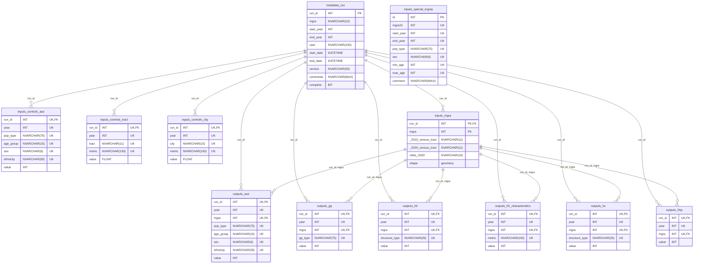

## Setup

Clone the repository and ensure an installation of [Miniconda/Anaconda](https://docs.conda.io/projects/miniconda/en/latest/) exists. Use the **environment.yml** file in the root directory of the project to [create the Python virtual environment](https://docs.conda.io/projects/conda/en/4.6.1/user-guide/tasks/manage-environments.html#creating-an-environment-from-an-environment-yml-file) needed to run the project.

Set the configuration file **config.yml** parameters specific to the run in the project root directory.

### Configuration File Settings

The default version of the runtime configuration file is copied here, with comments explaining each and every key/value pair

```yaml
# Configuration for what parts of the Estimates Program to run. Since this file may be
# modified from the default settings, you can always restore to default using the copy
# stored in README.md. For brevity, detailed comments have been removed from this file

# The 'run' section contains configuration for running every module of the Estimates
# Program for a specified set of years
run:
  
  # Whether to use the 'run' section. Mutually exclusive with 'debug' mode
  enabled: False
  
  # The MGRA series to use for this run. Currently only 'mgra15' is valid
  mgra: mgra15
  
  # The first year inclusive to start running from
  start_year: 2020
  
  # The last year inclusive to end running with
  end_year: 2023
  
  # The code version
  version: 0.0.0-dev
  
  # Additional notes on this run
  comments: Example comment

# The 'debug' section contains configuration for running a subset of modules of the
# Estimates Program for a given set of years. All parameters must be provided except for
# 'run_id', 'version', and 'comments'. If 'run_id' is 'null', then a new 'run_id' will 
# be automatically created, similar to 'run' mode
debug:
  
  # Whether to use the 'debug' section. Mutually exclusive with 'run' mode
  enabled: False
  
  # (Optional) If provided, then most parameters in the 'debug' section will be pulled 
  # from '[run].[metadata]'. If not provided, then a new 'run_id' will be automatically 
  # created
  run_id: null
  
  # The first year inclusive and last year inclusive to run. In the case that...
  # * The value of 'run_id' is 'null', the values will be loaded into [metadata].[run]
  #   and will be used as is
  # * The value of 'run_id' is not 'null', the values will be checked against the values
  #   already in '[run].[metadata]'
  start_year: 2020
  end_year: 2023
  
  # (Optional) The code version. If provided, then 'run_id' must be 'null'
  version: 0.0.0-dev
  
  # (Optional) Additional notes on this run. If provided, then 'run_id' must be 'null'
  comments: null
  
  # Whether to run the 'startup' module
  startup: False
  
  # Whether to run the 'housing_and_households' module. If enabled, then any above 
  # modules must all be enabled due to module dependencies
  housing_and_households: False
  
  # Whether to run the 'population' module. If enabled, then any above modules must all
  # be enabled due to module dependencies
  population: False
  
  # Whether to run the 'population_by_ase' module. If enabled, then any above modules 
  # must all be enabled due to module dependencies
  population_by_ase: False
  
  # Whether to run the 'household_characteristics' module. If enabled, then any above 
  # modules must all be enabled due to module dependencies
  household_characteristics: False
  
  # Whether to run the 'staging' module. If enabled, then any above modules must all be
  # enabled due to module dependencies
  staging: False
```

### Configuration of Private Data in secrets.yml
In order to avoid exposing certain data to the public this repository uses a secrets file to store sensitive configurations in addition to a standard configuration file. This file is stored in the root directory of the repository as `secrets.yml` and is included in the `.gitignore` intentionally to avoid it ever being committed to the repository.

The `secrets.yml` should mirror the following structure.

```yaml
sql:
  estimates:
    server: <SqlInstanceName>  # SQL instance containing estimates database
    database: <SqlDatabaseName>  # database within SQL instance containing SQL build objects
  gis:
    server: <SqlInstanceName>  # SQL instance containing GIS database
    database: <SqlDatabaseName>  # database within instance containing GIS datasets (GQ/LUDU)
  staging: <FolderPath>  # unconditional network folder path visible to SQL instance for BULK INSERT
```

### Production Database Schema
