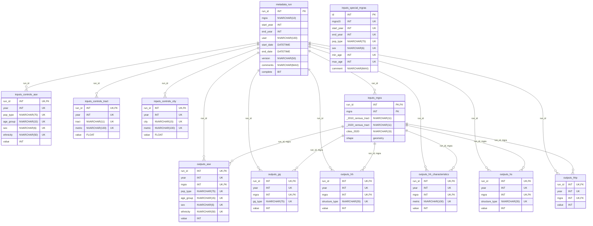

## Setup

Clone the repository and ensure an installation of [uv](https://docs.astral.sh/uv/getting-started/installation/) exists. Create a local virtual environment by running `uv venv` then `uv sync` in the command line. Ensure that a `secrets.toml` file exists

### Configuration of Private Data in secrets.toml
In order to avoid exposing certain data to the public this repository uses a secrets file to store sensitive configurations in addition to a standard configuration file. This file is stored in the root directory of the repository as `secrets.toml` and is included in the `.gitignore` intentionally to avoid it ever being committed to the repository.

The `secrets.toml` should mirror the following structure.

```toml
[sql.estimates]
server = "<SqlInstanceName>"  # SQL instance containing estimates database
database = "<SqlDatabaseName>"  # database within SQL instance containing SQL build objects

[sql.gis]
server = "<SqlInstanceName>"  # SQL instance containing GIS database
database = "<SqlDatabaseName>"  # database within instance containing GIS datasets (GQ/LUDU)

[sql]
staging = '<FolderPath>'  # unconditional network folder path visible to SQL instance for BULK INSERT
```

## Running

Set the configuration file `config.toml` parameters specific to the run in the project root directory. Finally, simply execute `uv run main.py` in the main project directory

### Configuration File Settings     

The default version of the runtime configuration file is copied here, with comments explaining each and every key/value pair

```toml
# Configuration for what parts of the Estimates Program to run. Since this file may be
# modified from the default settings, you can always restore to default using the copy
# stored in README.md. For brevity, detailed comments have been removed from this file

# The 'run' section contains configuration for running every module of the Estimates
# Program for a specified set of years
[run]

# Whether to use the 'run' section. Mutually exclusive with 'debug' mode
enabled = false

# The MGRA series to use for this run. Currently only 'mgra15' is valid
mgra = "mgra15"

# The first year inclusive to start running from
start_year = 2020

# The last year inclusive to end running with
end_year = 2024

# The code version
version = "1.1.1-dev"

# Additional notes on this run
comments = "Example comment"

# The `debug` section contains configuration for running a single module for a single
# year based on the input data of an existing complete Estimates run. Output data is not
# written to database, but is instead saved to a local folder debug_output\, which is 
# ignored by .gitignore. No data is saved locally for the "startup" and "staging" 
# modules
[debug]

# Whether to use the 'debug' section. Mutually exclusive with 'run' mode
enabled = false

# The [run_id] of a fully [complete] Estimates Program run. Input data for debugging
# will be pulled from this [run_id]
run_id = 82 # The run_id for the released v24 Estimates

# The year of the Estimates Program to run. This year must be consistent with the stored
# [start_year] and [end_year] associated with the above [run_id] in [metadata].[run]
year = 2020

# The module of the Estimates Program to run. Since only [complete] [run_id]s are 
# allowed, this can be any Estimates Program module. Explicitly, the valid inputs
# are "startup", "housing_and_households", "population", "population_by_ase", 
# "household_characteristics", "employment", or "staging"
module = ""
```

### Production Database Schema

```mermaid
erDiagram
direction TB

    metadata_run {
        run_id INT PK
        mgra NVARCHAR(10)
        start_year INT
        end_year INT
        user NVARCHAR(100)
        start_date DATETIME
        end_date DATETIME
        version NVARCHAR(50)
        comments NVARCHAR(MAX)
        complete BIT
    }

    inputs_controls_ase {
        run_id INT UK, FK
        year INT UK
        pop_type NVARCHAR(75) UK
        age_group NVARCHAR(15) UK
        sex NVARCHAR(6) UK
        ethnicity NVARCHAR(50) UK
        value INT
    }

    inputs_controls_tract {
        run_id INT UK, FK
        year INT UK
        tract NVARCHAR(11) UK
        metric NVARCHAR(100) UK
        value FLOAT
    }

    inputs_controls_city {
        run_id INT UK, FK
        year INT UK
        city NVARCHAR(15) UK
        metric NVARCHAR(100) UK
        value FLOAT
    }

    inputs_mgra {
        run_id INT PK, FK
        mgra INT PK
        _2010_census_tract NVARCHAR(11)
        _2020_census_tract NVARCHAR(11)
        cities_2020 NVARCHAR(15)
        shape geometry
    }

    inputs_special_mgras {
        id INT PK
        mgra15 INT UK
        start_year INT UK
        end_year INT UK
        pop_type NVARCHAR(75) UK
        sex NVARCHAR(6) UK
        min_age INT UK
        max_age INT UK
        comment NVARCHAR(MAX)
    }

    outputs_ase {
        run_id INT UK, FK
        year INT UK
        mgra INT UK, FK
        pop_type NVARCHAR(75) UK
        age_group NVARCHAR(15) UK
        sex NVARCHAR(6) UK
        ethnicity NVARCHAR(50) UK
        value INT
    }

    outputs_gq {
        run_id INT UK, FK
        year INT UK
        mgra INT UK, FK
        gq_type NVARCHAR(75) UK
        value INT
    }

    outputs_hh {
        run_id INT UK, FK
        year INT UK
        mgra INT UK, FK
        structure_type NVARCHAR(35) UK
        value INT
    }

    outputs_hh_characteristics {
        run_id INT UK, FK
        year INT UK
        mgra INT UK, FK
        metric NVARCHAR(100) UK
        value INT
    }

    outputs_hs {
        run_id INT UK, FK
        year INT UK
        mgra INT UK, FK
        structure_type NVARCHAR(35) UK
        value INT
    }

    outputs_hhp {
        run_id INT UK, FK
        year INT UK
        mgra INT UK, FK
        value INT
    }

    %% Relationships
    metadata_run ||--o{ inputs_controls_ase : "run_id"
    metadata_run ||--o{ inputs_controls_tract : "run_id"
    metadata_run ||--o{ inputs_controls_city : "run_id"
    metadata_run ||--o{ inputs_mgra : "run_id"
    metadata_run ||--o{ outputs_ase : "run_id"
    metadata_run ||--o{ outputs_gq : "run_id"
    metadata_run ||--o{ outputs_hh : "run_id"
    metadata_run ||--o{ outputs_hh_characteristics : "run_id"
    metadata_run ||--o{ outputs_hs : "run_id"
    metadata_run ||--o{ outputs_hhp : "run_id"

    inputs_mgra ||--o{ outputs_ase : "run_id, mgra"
    inputs_mgra ||--o{ outputs_gq : "run_id, mgra"
    inputs_mgra ||--o{ outputs_hh : "run_id, mgra"
    inputs_mgra ||--o{ outputs_hh_characteristics : "run_id, mgra"
    inputs_mgra ||--o{ outputs_hs : "run_id, mgra"
    inputs_mgra ||--o{ outputs_hhp : "run_id, mgra"
```