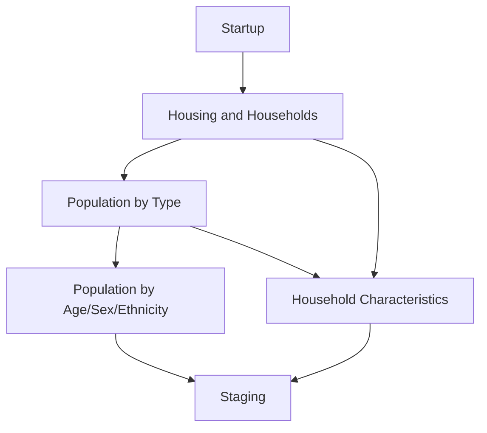

# SANDAG ESTIMATES PROGRAM

SANDAG has produced annual population and housing estimates since 1974. These estimates provide both internal and external customers with sub-jurisdiction-level information about population, housing, demographic, and household characteristics from a composite of data sources. They supplement the decennial census and American Community Survey (ACS) datasets for the San Diego region.

As new input data used to calculate the estimates—such as new releases from the Census Bureau, SANDAG’s Land Use and Dwelling Unit Inventory (LUDU), or the California Department of Finance (DOF)—are made available each year, we provide new editions of our estimates. It is a best practices to use the most recent release available.

Estimates are created for Master Geographic Reference Areas (MGRAs), SANDAG's atomic unit of geography, with results available at larger and more aggregate geographies, where data is more accurate and reliable. Find SANDAG’s estimates products on the [Open Data Portal](https://opendata.sandag.org/stories/s/g7b3-cqbq).

# Modules

SANDAG's Estimates Program consists of multiple self-contained modules. Each module has clearly defined inputs/outputs and a deterministic pathway between them. This makes debugging easier and outputs consistent. The modular structure allows users to run specific parts of the program in order to generate specific data. Instructions for running the entirety or only part of the Estimates Program can be found in the `README.md` in the "Code" section of this repository.

The following table contains a high-level overview of each module, including the inputs, outputs, and a quick description. For more in-depth descriptions, including the actual algorithms used, follow the links to module specific pages under the `Module` column. Be aware that inputs to individual modules can be dependent on and created by previous modules, such as "Households in each MGRA" in the "Population by Type" module. Also, note that not included in the below table is the [Utility](/documentation/Utility.md) module, which contains various helpful cross-module functionality 

| Module                                                                               | Input(s)                                                                                                                                                                                                                                                                                                                                                                                                                                                                                                                                                                                                                          | Output(s)                                                                   | Description                                                                                                                                                                                                                                                                                                                                                                                                                                                                                                                                                                                                                                                                                                                                                                                                                                                                                                                                                                                                                                                                                                                                                                                                                                                  | 
|--------------------------------------------------------------------------------------|-----------------------------------------------------------------------------------------------------------------------------------------------------------------------------------------------------------------------------------------------------------------------------------------------------------------------------------------------------------------------------------------------------------------------------------------------------------------------------------------------------------------------------------------------------------------------------------------------------------------------------------|-----------------------------------------------------------------------------|--------------------------------------------------------------------------------------------------------------------------------------------------------------------------------------------------------------------------------------------------------------------------------------------------------------------------------------------------------------------------------------------------------------------------------------------------------------------------------------------------------------------------------------------------------------------------------------------------------------------------------------------------------------------------------------------------------------------------------------------------------------------------------------------------------------------------------------------------------------------------------------------------------------------------------------------------------------------------------------------------------------------------------------------------------------------------------------------------------------------------------------------------------------------------------------------------------------------------------------------------------------|
| [Startup](/documentation/Startup.md)                                                 | None                                                                                                                                                                                                                                                                                                                                                                                                                                                                                                                                                                                                                              | MGRA cross reference. Special MGRAs.                                        | Create MGRA geography for subsequent modules. The MGRA geography and cross-reference output is a fundamental input to each module of the Estimates Program. As such, it is not listed in subsequent input(s) sections as it is always present.                                                                                                                                                                                                                                                                                                                                                                                                                                                                                                                                                                                                                                                                                                                                                                                                                                                                                                                                                                                                               |
| [Housing and Households](/documentation/Housing-and-Households.md)                   | Point geometry housing stock by land use. Census tract occupancy rates by structure type. City total occupancy rate controls.                                                                                                                                                                                                                                                                                                                                                                                                                                                                                                     | Housing structures and households by structure type in each MGRA.           | Aggregate point geometry housing counts to the MGRA-level by structure type. Apply census tract-level occupancy rates by structure type to get households by structure type. Control overall occupancy rate to city-level controls.                                                                                                                                                                                                                                                                                                                                                                                                                                                                                                                                                                                                                                                                                                                                                                                                                                                                                                                                                                                                                          |
| [Population by Type](/documentation/Population-by-Type.md)                           | Special MGRAs. Point geometry group quarters by type. City population by type controls. Households in each MGRA. Census tract average household size. City household population controls.                                                                                                                                                                                                                                                                                                                                                                                                                                         | Population by structure type in each MGRA.                                  | Aggregate point group quarters to MGRAs. Control total group quarters to city-level controls. Apply census tract-level average household size to households to get household population. Control household population to city-level controls.                                                                                                                                                                                                                                                                                                                                                                                                                                                                                                                                                                                                                                                                                                                                                                                                                                                                                                                                                                                                                |
| [Population by Age/Sex/Ethnicity](/documentation/Population-by-Age-Sex-Ethnicity.md) | To create regional age/sex/ethnicity controls by housing type: * Regional population by housing type * Regional age/sex/ethnicity distributions for group quarters by type  Regional age/sex/ethnicity controls for total population.  To create census tract seed data: * Census tract distributions of ethnicity, age, and age/ethnicity.  To create population by age/sex/ethnicity by housing type: * Households in each MGRA * Population by structure type in each MGRA * Special MGRAs * Regional age/sex/ethnicity controls by housing type * Census tract seed data. | Population by Age/Sex/Ethnicity by housing type in each MGRA.               | Apply regional age/sex/ethnicity distributions for group quarters by type to regional group quarters population by type to get regional age/sex/ethnicity population for group quarters by type. Calculate regional age/sex/ethnicity household population as the remainder of regional age/sex/ethnicity controls for total population. This creates regional age/sex/ethnicity controls for population by housing type.     Take census tract 5-year ACS Detailed Tables providing age/sex/ethnicity information and use an iterative proportional fitting procedure to create age/sex/ethnicity distributions by census tract to be used as seed data in calculating age/sex/ethnicity at the MGRA-level.     Adjust census tract seed data applying age/sex restrictions for special MGRAs. Take the census tract seed data, regional age/sex/ethnicity controls for population by housing type, and MGRA-level population by housing type and use an iterative proportional fitting procedure to create MGRA-level age/sex/ethnicity population by housing type. Use the special MGRAs age/sex restriction and households in each MGRA to apply balancers ensuring restrictions and householder populations are respected within each MGRA. |
| [Household Characteristics](/documentation/Household-Characteristics.md)             | Households in each MGRA. Household population in each MGRA. Census tract household income distributions. Census tract households by size distributions.                                                                                                                                                                                                                                                                                                                                                                                                                                                                           | Households by income category and households by size category in each MGRA. | Apply census tract households by income category to households in each MGRA.     Apply census tract households by size category to households in each MGRA. Balance households by size category such that the implied household population is in accordance with the household population in each MGRA.                                                                                                                                                                                                                                                                                                                                                                                                                                                                                                                                                                                                                                                                                                                                                                                                                                                                                                                                                |
| [Staging](/documentation/Staging.md)                                                 | None                                                                                                                                                                                                                                                                                                                                                                                                                                                                                                                                                                                                                              | None                                                                        | Marks the estimates run as completed in the production database.                                                                                                                                                                                                                                                                                                                                                                                                                                                                                                                                                                                                                                                                                                                                                                                                                                                                                                                                                                                                                                                                                                                                                                                             |

In graph form, the web of dependencies is as follows:

Additionally, shared functionalities across modules are stored in the [Utility](/documentation/Utility.md) module. This module contains software configurations specified in the `config.yml`, helper functions for rounding and integerization, as well as a handler allowing the program to use earlier ACS 5-year releases if the current year release is unavailable.

# Navigation

* Home Page
* [Startup](Startup.md)
* [Housing and Households](Housing-and-Households.md)
* [Population by Type](Population-by-Type.md)
* [Population by Age/Sex/Ethnicity](Population-by-Age-Sex-Ethnicity.md)
    * [Regional Age/Sex/Ethnicity Controls by Housing Type](ase/Regional-Age-Sex-Ethnicity-Controls-By-Housing-Type.md)
    * [Census Tract Age/Sex/Ethnicity Seed](ase/Census-Tract-Age-Sex-Ethnicity-Seed.md)
* [Household Characteristics](Household-Characteristics.md)
* [Staging](Staging.md)
* [Utility](Utility.md)